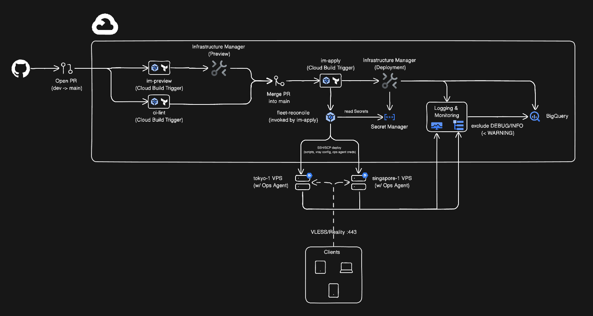
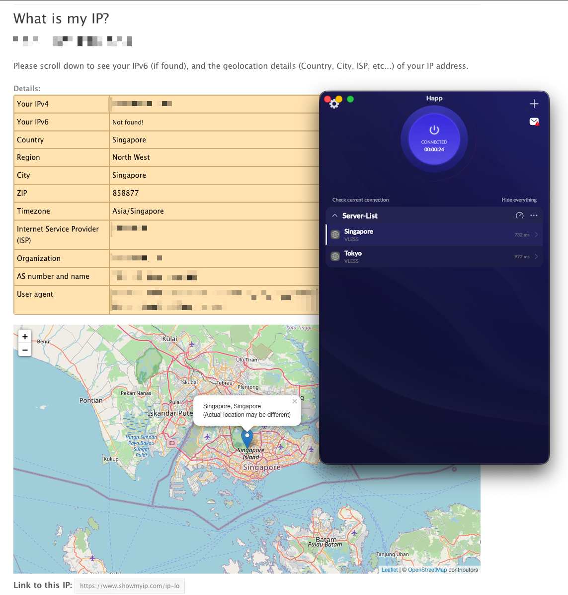
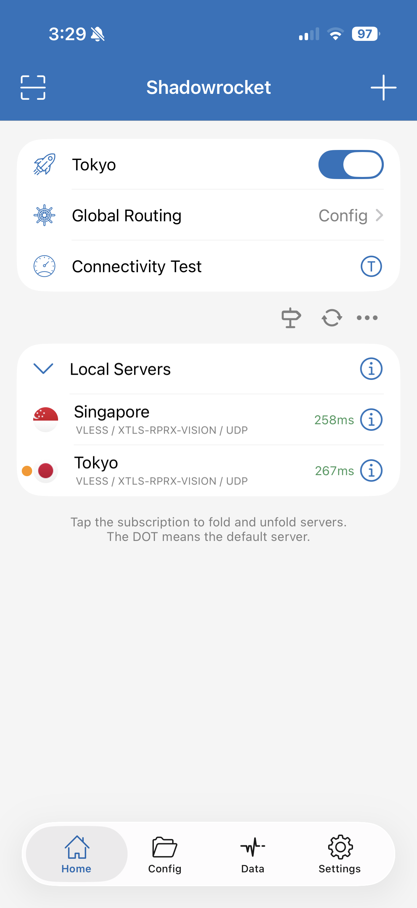

# Custom VPN

A self-managed VPN using **Xray VLESS + Reality**, built for privacy in restrictive network environments.

I built this to have a personal VPN that bypasses deep packet inspection (DPI). The whole thing runs on infrastructure-as-code with automated deployments.

---

## Why This Project Exists

I'm planning a trip to a country where accessing Google services (which I use daily) isn't straightforward. Commercial VPNs get blocked there because their traffic patterns are easy to spot.

I wanted something that:

- **Looks like regular HTTPS traffic** to network inspectors
- **Runs on my own servers** so I control everything
- **Deploys automatically** when I push code
- **Handles secrets properly** because VPN keys and SSH access need care

---

## Architecture at a Glance



---

## Bootstrapping: The Chicken-and-Egg Problem

Before Terraform and Cloud Build can manage the infrastructure, some resources need to exist first. You can't use automation to create the automation itself.

### What I Bootstrap Manually

1. **GCP Project Creation**: The project must be created through the Console or CLI first.

2. **Initial Service Accounts**: The `im-executor` service account (which runs Terraform) needs to exist before Terraform can manage other resources. I created it manually, then imported it into Terraform state.

3. **GitHub Connection**: Cloud Build needs a 2nd generation connection to access private repos. This requires OAuth authorization through the Console.

4. **Initial IAM Roles**: Some roles (like `roles/resourcemanager.projectIamAdmin`) cannot be assigned through the Terraform GCP provider due to API limitations. These stay manually managed and are documented in code comments.

5. **First Secret Values**: SSH keys, Xray credentials, and other secrets need initial values. I populate these through the Console, then Terraform manages the containers going forward.

### A Note on My Workflow

I'll be honest: I created more resources through the Console than I had to. A lot of things that could have been Terraform-first were click-first-then-import instead.

This isn't best practice. The "right" way is to define everything in Terraform from the start. But when I'm debugging IAM permissions or figuring out which APIs a service needs, clicking through the Console is faster than write-plan-apply cycles.

Once something works, I import it into Terraform. The end result is the same (infrastructure as code with full state management), but the path is more exploratory. For a personal project where I'm the only operator, this trade-off works for me.

### From Bootstrap to Terraform-Managed

After the bootstrap, I use Terraform `import` blocks to bring existing resources into state management:

- Resources created during bootstrap become managed-as-code
- Future changes go through PR → review → merge
- The bootstrap steps are documented so I can reproduce them if needed

---

## Security Choices

### Principle of Least Privilege (PoLP)

I use **separate service accounts for each Cloud Build trigger** instead of one powerful account for everything:

| Trigger           | Service Account      | What It Can Do                      |
| ----------------- | -------------------- | ----------------------------------- |
| `ci-lint`         | `cb-ci-lint`         | Write logs (nothing else)           |
| `im-preview`      | `cb-im-preview`      | Create Terraform previews           |
| `im-apply`        | `cb-im-apply`        | Apply Terraform changes             |
| `fleet-reconcile` | `cb-fleet-reconcile` | Access fleet secrets, deploy to VPS |

The `im-executor` account runs Terraform with broad permissions, but **only the deployment triggers can impersonate it**. The linting trigger has no infrastructure access at all.

### Secret-Level IAM

I bind `secretAccessor` only on specific secrets that each account needs, not project-wide. The fleet reconciliation trigger can read VPS credentials but nothing else.

### Separation of Duties (SoD)

Different stages of the pipeline use different identities:

- **Linting** (security scanning) can't modify infrastructure
- **Preview** can read state but can't apply changes
- **Apply** requires a merge to `main`, creating an audit trail
- **Fleet deployment** only runs after infrastructure changes succeed

### Credential Handling

Secrets never appear in logs or process listings:

- SSH keys and Xray credentials are written to temporary files with `chmod 600`
- A cleanup trap removes secrets after each build step
- On the VPS, secrets are sourced from files then shredded

### SSH Host Key Pinning

I don't use `StrictHostKeyChecking=no` (which accepts any server identity). Instead:

- I scan host keys during VPS setup and store them in Secret Manager
- The deployment pipeline uses these pinned keys with `StrictHostKeyChecking=yes`
- If a server's identity changes unexpectedly, the deploy fails, protecting against man-in-the-middle attacks

### VPS Account Privileges

The Xray service runs as a dedicated `xray` user, not root:

- Config files are `chmod 600` (only Xray can read them)
- The service drops all Linux capabilities except `CAP_NET_BIND_SERVICE` (needed for port 443)
- Systemd sandboxing restricts file system access

### Supply Chain Security

I verify external dependencies before trusting them:

- **Xray binary**: Downloaded with SHA256 checksum verification
- **yq** (YAML parser): Pinned version with checksum verification
- **Ops Agent**: Installed from Google's GPG-signed repository
- **Terraform providers**: Version constraints prevent surprise updates

### CI Security Gates

Every pull request runs through automated security checks:

- `terraform fmt -check` for formatting
- `terraform validate` for syntax
- `tflint` for Terraform best practices
- `tfsec` for security vulnerabilities
- `shellcheck` for bash scripts
- `gitleaks` for leaked secrets

A PR cannot merge if any check fails.

---

## Why Xray VLESS + Reality (Not WireGuard or IKEv2)

### The Problem with Standard VPN Protocols

**WireGuard** is fast and modern, but its traffic pattern is distinctive. It uses UDP on a fixed port with a recognizable handshake. DPI systems identify and block it easily.

**IKEv2/IPSec** is widely supported but just as recognizable. The IKE handshake has known signatures that firewalls match against.

**OpenVPN** over TLS looks like HTTPS initially, but the handshake diverges from real TLS behavior. Advanced DPI detects it through timing analysis and certificate inspection.

### How Reality Solves This

Reality doesn't wrap traffic in TLS. It **impersonates a real website**:

1. **Server Name Indication (SNI)**: My VPN handshake claims to be connecting to a legitimate website (like a tech company's homepage)
2. **TLS Fingerprinting**: The connection mimics Chrome's TLS implementation, including cipher suites and extensions
3. **Certificate Validation**: If someone tries to probe my server, they get forwarded to the real website
4. **Zero Encryption Overhead**: VLESS itself doesn't add encryption. The TLS session handles it

### Choosing Your VPS Provider

Before renting a VPS, check that its IP range isn't already blocked in your target country. Popular budget providers like Contabo, Hetzner, DigitalOcean, and Vultr have their IP ranges partially or fully blacklisted because they're commonly used for proxies.

Tips for avoiding blocked IPs:

- **Use the provider's looking glass**: Most VPS providers have a looking glass page with test IPs. Test these from your target country before purchasing
- **Consider smaller or regional providers**: Less popular providers often have cleaner IP reputations
- **Check IP reputation**: [IPinfo.io](https://ipinfo.io) shows if an IP is flagged as datacenter/proxy
- **Have a backup plan**: Some providers let you change IPs if your first one is blocked

### Choosing Your Decoy Website (SNI)

The SNI you choose matters. Pick a website that:

- **Is accessible from your target country** (if it's blocked there, impersonating it looks suspicious)
- **Uses TLS 1.3** (Reality requires it)
- **Isn't a VPN/proxy service** (those domains get extra scrutiny)
- **Has servers near your VPS** (reduces latency anomalies)

I use [globalping.io](https://www.globalping.io) to test website accessibility from different countries before choosing an SNI. Run an HTTP check from your target country to verify the decoy site responds normally there.

### My Configuration Choices

```json
{
  "flow": "xtls-rprx-vision", // Vision flow for stealth
  "fingerprint": "chrome", // Mimics Chrome TLS behavior
  "spiderX": "/", // Simulates browsing patterns
  "shortIds": ["abc123..."] // Unique per-server
}
```

**Vision flow** is the recommended mode for Reality. It optimizes how traffic passes through the TLS session, avoiding patterns that older flows created.

**Chrome fingerprint** means the TLS handshake includes the same cipher suites, extensions, and ordering that Chrome uses. To an observer, it looks like Chrome connecting to a website.

### Understanding shortIds

**shortIds** are hex strings (8-16 characters) that act as an extra authentication layer between client and server. Think of them as a shared secret that proves the client is legitimate.

Why they matter:

- **Probe resistance**: If someone finds your server IP and tries to connect without a valid shortId, Reality forwards them to the decoy website instead of revealing it's a VPN
- **Client rotation**: I configure 2-3 shortIds per server. If one gets flagged, clients can switch to another without touching the server config
- **Unique per server**: Each VPS gets different shortIds, so compromising one doesn't affect others

---

## Client Setup

### Retrieving Your VLESS Configuration

After deployment, you need to get the VLESS connection URL from your VPS. SSH into the server and run:

```bash
ssh root@<your-vps-ip>
cat /etc/xray/client_url.txt
```

This outputs a URL that looks like:

```
vless://uuid@ip:port?encryption=none&flow=xtls-rprx-vision&security=reality&sni=example.com&fp=chrome&pbk=publickey&sid=shortid&type=tcp#ServerName
```

Copy this entire URL.

### macOS: Happ (Free)

1. Install [Happ](https://apps.apple.com/app/id6504287215) from the App Store
2. Copy the VLESS URL to your clipboard
3. Open Happ and click "Add from Clipboard"
4. The server appears in your list, ready to connect



### iOS: Shadowrocket ($2.99)

1. Install [Shadowrocket](https://apps.apple.com/app/id932747118) from the App Store
2. Copy the VLESS URL to your clipboard
3. Open Shadowrocket and tap the "+" button
4. Select "Add from Clipboard"
5. The server is added to your list



### Verifying the Connection

Once connected, verify your traffic is going through the VPS:

```bash
curl -s ifconfig.me
```

This should return your VPS IP, not your local IP.

---

## CI/CD Pipeline

The pipeline uses GitOps: code changes trigger automated deployments, with previews and gates along the way.

### Trigger Chain

```
┌─────────────────────────────────────────────────────────────────┐
│                        Pull Request                             │
└─────────────────────────────────────────────────────────────────┘
        │                              │
        ▼                              ▼
┌───────────────┐              ┌───────────────┐
│   ci-lint     │              │  im-preview   │
│ Security scan │              │ Terraform plan│
└───────────────┘              └───────────────┘
        │                              │
        └───────────┬──────────────────┘
                    ▼
             Both must pass
                    │
                    ▼
           Merge to main
                    │
                    ▼
          ┌─────────────────┐
          │    im-apply     │
          │ Terraform apply │
          └─────────────────┘
                    │
                    ▼  triggers on success
          ┌─────────────────┐
          │ fleet-reconcile │
          │  Deploy to VPS  │
          └─────────────────┘
```

### What Each Trigger Does

**ci-lint** (runs on PRs):

- Validates Terraform syntax and formatting
- Scans for security issues and leaked secrets
- Checks shell script quality
- Fails fast on obvious problems

**im-preview** (runs on PRs):

- Creates a Terraform plan through Infrastructure Manager
- Shows what would change without modifying anything
- Helps reviewers understand the impact

**im-apply** (runs on merge to main):

- Applies the Terraform changes
- On success, triggers `fleet-reconcile`
- Only runs when infrastructure code changes

**fleet-reconcile** (triggered by im-apply):

- Connects to each VPS via SSH
- Deploys Xray config and logging agents
- Idempotent, safe to run repeatedly
- Reports per-server success/failure

### Why This Order Matters

Infrastructure changes must complete before fleet deployment. If Terraform creates a new secret, the fleet reconciler needs that secret to exist when it runs. The trigger chain ensures this ordering.

### A Note on Environments

In a production setup, you'd typically have separate environments (dev, staging, prod) with their own GCP projects and VPS fleets. Changes would promote through each environment before reaching production.

For this project, I use a single environment. The reasons are practical: I don't want to pay for VPS instances in multiple environments for a personal side project. The preview deployment (`im-preview`) gives me a safe way to validate Terraform changes before they apply, which covers most of the risk that multiple environments would address.

---

## Repository Structure

```
vless-reality-gcp/
├── assets/                        # Documentation assets
│   └── architecture_diagram.png   # Architecture diagram
│
├── cloudbuild/                    # CI/CD pipeline definitions
│   ├── _env.sh                    # Shared config (project ID, etc.)
│   ├── ci-lint.yaml               # Security scanning and linting
│   ├── im-preview.yaml            # PR preview workflow
│   ├── im-apply.yaml              # Merge-to-main workflow
│   └── fleet-reconcile.yaml       # VPS deployment workflow
│
├── fleet/                         # VPS configuration
│   ├── servers.yaml               # Fleet inventory (IPs, regions, SNIs)
│   ├── scripts/
│   │   ├── setup-logging-agent.sh # Ops Agent installer
│   │   └── setup-xray.sh          # Xray installer
│   └── templates/
│       ├── xray-config.json.tpl   # Xray server config
│       ├── xray.service           # Systemd unit file
│       └── xray-logrotate.conf    # Log rotation settings
│
├── infra/terraform/envs/prod/     # GCP infrastructure (Terraform)
│   ├── apis.tf                    # Required GCP APIs
│   ├── service_accounts.tf        # Service accounts and IAM
│   ├── secrets.tf                 # Secret Manager resources
│   ├── logging.tf                 # BigQuery and log sinks
│   └── cloudbuild_triggers.tf     # CI/CD trigger definitions
│
└── README.md                      # This file
```

---

## Monitoring and Logging

VPS logs flow to Google Cloud Logging, then to BigQuery:

- Only **error-level** Xray logs are captured (no verbose access logs)
- BigQuery tables expire after **7 days** to control costs
- Host metrics (CPU, memory) collected every 60 seconds

Estimated logging cost: **less than €0.10/month**

---

## License

MIT License

Copyright (c) 2025-2026 Scott Santinho

Permission is hereby granted, free of charge, to any person obtaining a copy of this software and associated documentation files (the "Software"), to deal in the Software without restriction, including without limitation the rights to use, copy, modify, merge, publish, distribute, sublicense, and/or sell copies of the Software, and to permit persons to whom the Software is furnished to do so, subject to the following conditions:

The above copyright notice and this permission notice shall be included in all copies or substantial portions of the Software.

THE SOFTWARE IS PROVIDED "AS IS", WITHOUT WARRANTY OF ANY KIND, EXPRESS OR IMPLIED, INCLUDING BUT NOT LIMITED TO THE WARRANTIES OF MERCHANTABILITY, FITNESS FOR A PARTICULAR PURPOSE AND NONINFRINGEMENT. IN NO EVENT SHALL THE AUTHORS OR COPYRIGHT HOLDERS BE LIABLE FOR ANY CLAIM, DAMAGES OR OTHER LIABILITY, WHETHER IN AN ACTION OF CONTRACT, TORT OR OTHERWISE, ARISING FROM, OUT OF OR IN CONNECTION WITH THE SOFTWARE OR THE USE OR OTHER DEALINGS IN THE SOFTWARE.

---

## Creator

**Scott Santinho**

Shell scripts and README written with assistance from Claude 4.5 Opus.
